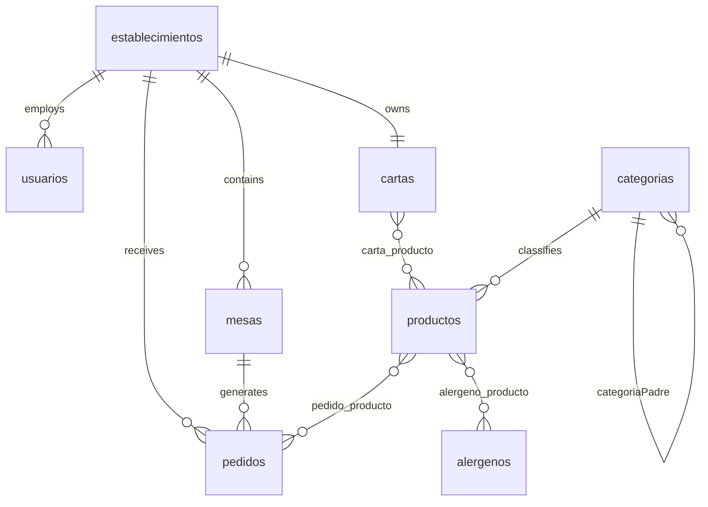

# SitScan API - Sistema de Pedidos por QR para Hostelería

Sistema de gestión de pedidos para establecimientos de hostelería que permite a los clientes realizar pedidos escaneando códigos QR en sus mesas.

## Características Principales

- **Sistema Multi-Establecimiento**: Gestión independiente de múltiples locales con datos aislados
- **Pedidos por QR**: Los clientes escanean el código QR de su mesa para acceder a la carta y realizar pedidos
- **Gestión de Productos**: Catálogo jerárquico de productos con categorías anidadas
- **Control de Roles**: Sistema de permisos con roles de Administrador, Gerente y Camarero
- **Gestión de Alérgenos**: Etiquetado de productos con información de alérgenos

## Arquitectura

### Modelo de Datos Multi-Tenant

El sistema está diseñado con una arquitectura multi-tenant donde cada `Establecimiento` opera independientemente con sus propias tablas, usuarios, pedidos y menú [1](#0-0) .

### Entidades Principales

- **Establecimientos**: Locales físicos (restaurantes, bares)
- **Mesas**: Mesas dentro de cada establecimiento con códigos QR únicos
- **Productos**: Catálogo de items con categorías jerárquicas
- **Pedidos**: Órdenes asociadas a mesa y establecimiento
- **Usuarios**: Personal con roles diferenciados



## Instalación

### Prerrequisitos

- PHP >= 7.2|^8.0
- MySQL
- Composer

### Pasos

1. Clonar el repositorio
2. Instalar dependencias:
   ```bash
   composer install
   ```
3. Configurar archivo `.env` con credenciales de base de datos
4. Ejecutar migraciones:
   ```bash
   php artisan migrate
   ```
5. Ejecutar seeders para datos iniciales:
   ```bash
   php artisan db:seed
   ```

## Uso

### Flujo de Pedido

1. El cliente escanea el código QR de la mesa
2. Accede a la carta del establecimiento
3. Selecciona productos y añade al pedido
4. El pedido aparece en el panel de gestión del personal

### Roles de Usuario

- **ADMINISTRADOR**: Acceso a todos los establecimientos
- **GERENTE**: Gestión completa de su establecimiento
- **CAMARERO**: Visualización y actualización de pedidos

## Tecnologías

- **Backend**: Laravel Framework
- **Base de Datos**: MySQL con Eloquent ORM
- **Frontend**: Blade templates con Bootstrap/MDB
- **Autenticación**: Laravel UI

## Estructura del Proyecto

```
app/
├── Http/Controllers/
│   └── Producto/
├── Models/
│   ├── Establecimiento.php
│   ├── Mesa.php
│   ├── Producto.php
│   ├── Categoria.php
│   ├── Pedido.php
│   └── Carta.php
database/
├── migrations/
└── seeds/
resources/
└── views/
    ├── layouts/
    └── landingpage.blade.php
```

